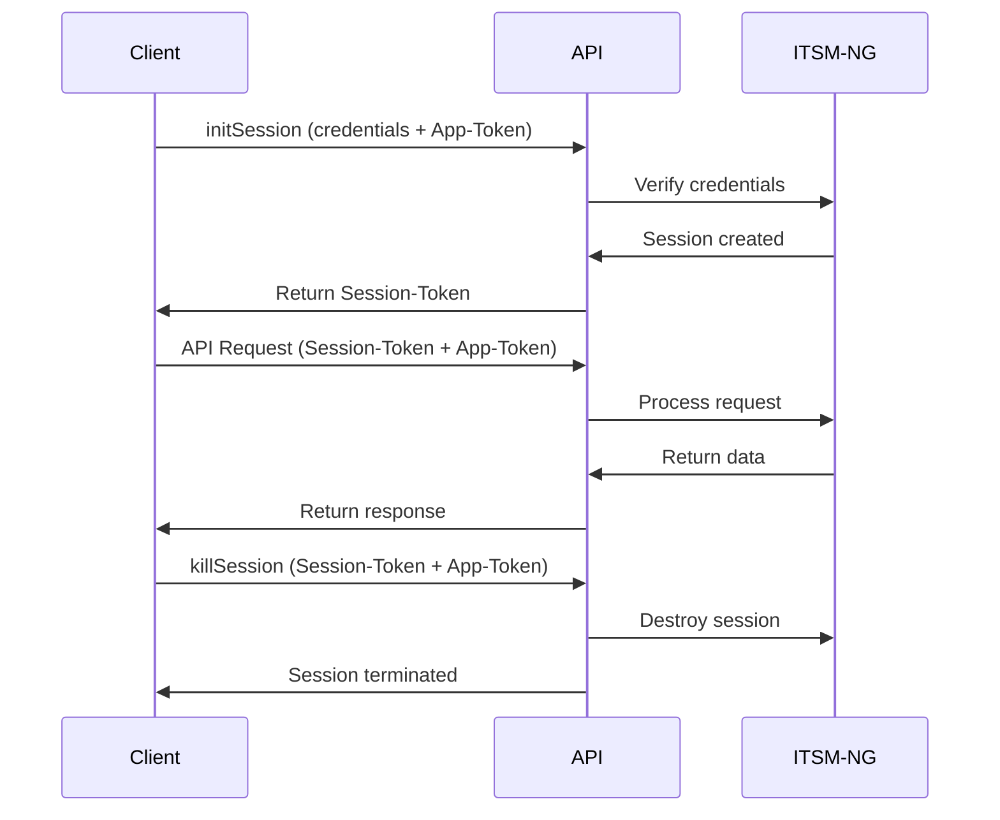

The ITSM-NG API uses a token-based authentication system with three types of tokens:

1. **App-Token** (optional) - Application-level authorization
2. **Session-Token** (required) - User session identification
3. **User Token** (alternative) - Personal access key

## Authentication Flow



## App-Token

The **App-Token** is an optional application-level authorization string that identifies your API client.

### Purpose

- Filter API access by application
- Track API usage per client
- Add an extra layer of security
- Restrict access by IP address per client

### Configuration

1. Navigate to **Setup > General > API** in ITSM-NG
2. Create a new API client
3. Configure:
   - **Name**: Your application name
   - **Active**: Yes
   - **IPv4 address range** or **IPv6 address**: Allowed IPs
   - **Application token**: Auto-generated or custom

<Warning>
If App-Token is configured for an API client, it must be provided in **all** API requests. Requests without a valid App-Token will be rejected with `ERROR_NOT_ALLOWED_IP` or `ERROR_APP_TOKEN_PARAMETERS_MISSING`.
</Warning>

### Usage

Include the App-Token in the request header:

```bash
curl -X GET \
  -H 'Content-Type: application/json' \
  -H "App-Token: f7g3csp8mgatg5ebc5elnazakw20i9fyev1qopya7" \
  'http://your-domain/apirest.php/initSession'
```

Or as a query parameter:

```bash
http://your-domain/apirest.php/initSession?app_token=f7g3csp8mgatg5ebc5elnazakw20i9fyev1qopya7
```

## Session Token

The **Session-Token** is a unique identifier for your authenticated session.

### Obtaining a Session Token

Call the `initSession` endpoint with your credentials:

#### Method 1: User/Password Authentication

```bash
curl -X GET \
  -H 'Content-Type: application/json' \
  -H "Authorization: Basic $(echo -n 'username:password' | base64)" \
  -H "App-Token: f7g3csp8mgatg5ebc5elnazakw20i9fyev1qopya7" \
  'http://your-domain/apirest.php/initSession'
```

The `Authorization` header uses [HTTP Basic Authentication](https://en.wikipedia.org/wiki/Basic_access_authentication):
- Format: `Authorization: Basic base64(username:password)`
- Example: `glpi:glpi` becomes `Z2xwaTpnbHBp` when base64 encoded

<Info>
Login with credentials can be disabled in ITSM-NG configuration. If disabled, you must use a user_token instead.
</Info>

#### Method 2: User Token Authentication

```bash
curl -X GET \
  -H 'Content-Type: application/json' \
  -H "Authorization: user_token q56hqkniwot8wntb3z1qarka5atf365taaa2uyjrn" \
  -H "App-Token: f7g3csp8mgatg5ebc5elnazakw20i9fyev1qopya7" \
  'http://your-domain/apirest.php/initSession'
```

### Response

```json
{
  "session_token": "83af7e620c83a50a18d3eac2f6ed05a3ca0bea62"
}
```

### Using Session Token

Include the Session-Token in **all subsequent requests**:

```bash
curl -X GET \
  -H 'Content-Type: application/json' \
  -H "Session-Token: 83af7e620c83a50a18d3eac2f6ed05a3ca0bea62" \
  -H "App-Token: f7g3csp8mgatg5ebc5elnazakw20i9fyev1qopya7" \
  'http://your-domain/apirest.php/Computer/71'
```

Or as a query parameter:

```bash
http://your-domain/apirest.php/Computer/71?session_token=83af7e620c83a50a18d3eac2f6ed05a3ca0bea62
```

<Note>
While both header and query string methods work, using headers is recommended for better security.
</Note>

### Terminating a Session

Always terminate your session when finished:

```bash
curl -X GET \
  -H 'Content-Type: application/json' \
  -H "Session-Token: 83af7e620c83a50a18d3eac2f6ed05a3ca0bea62" \
  -H "App-Token: f7g3csp8mgatg5ebc5elnazakw20i9fyev1qopya7" \
  'http://your-domain/apirest.php/killSession'
```

Response: `200 OK`

## User Token

The **user_token** is a personal access key that can be used instead of username/password.

### Finding Your User Token

1. Log into ITSM-NG web interface
2. Navigate to **My Settings**
3. Go to the **Remote access key** tab
4. Copy your personal API token

### Using User Token

```bash
curl -X GET \
  -H 'Content-Type: application/json' \
  -H "Authorization: user_token q56hqkniwot8wntb3z1qarka5atf365taaa2uyjrn" \
  -H "App-Token: f7g3csp8mgatg5ebc5elnazakw20i9fyev1qopya7" \
  'http://your-domain/apirest.php/initSession'
```

<Warning>
Keep your user_token secure! It provides full access to your account without requiring a password.
</Warning>

## Advanced Session Options

### Get Full Session

Retrieve complete session data during initialization:

```bash
curl -X GET \
  -H 'Content-Type: application/json' \
  -H "Authorization: user_token q56hqkniwot8wntb3z1qarka5atf365taaa2uyjrn" \
  -H "App-Token: f7g3csp8mgatg5ebc5elnazakw20i9fyev1qopya7" \
  'http://your-domain/apirest.php/initSession?get_full_session=true'
```

Response:
```json
{
  "session_token": "83af7e620c83a50a18d3eac2f6ed05a3ca0bea62",
  "session": {
    "glpi_plugins": {...},
    "glpicookietest": {...},
    "glpiactive_entity": 0,
    "glpiname": "admin",
    ...
  }
}
```

### Session Write Mode

By default, API sessions are **read-only** to support parallel requests. Enable write mode when needed:

```bash
?session_write=true
```

<Note>
Certain endpoints automatically enable write mode:
- `initSession`
- `killSession`
- `changeActiveEntities`
- `changeActiveProfile`
</Note>

## Managing Profiles and Entities

### Get My Profiles

Retrieve all profiles associated with your account:

```bash
curl -X GET \
  -H 'Content-Type: application/json' \
  -H "Session-Token: 83af7e620c83a50a18d3eac2f6ed05a3ca0bea62" \
  -H "App-Token: f7g3csp8mgatg5ebc5elnazakw20i9fyev1qopya7" \
  'http://your-domain/apirest.php/getMyProfiles'
```

Response:
```json
{
  "myprofiles": [
    {
      "id": 1,
      "name": "Super-admin",
      "entities": [...]
    }
  ]
}
```

### Change Active Profile

```bash
curl -X POST \
  -H 'Content-Type: application/json' \
  -H "Session-Token: 83af7e620c83a50a18d3eac2f6ed05a3ca0bea62" \
  -H "App-Token: f7g3csp8mgatg5ebc5elnazakw20i9fyev1qopya7" \
  -d '{"profiles_id": 4}' \
  'http://your-domain/apirest.php/changeActiveProfile'
```

### Get My Entities

```bash
curl -X GET \
  -H 'Content-Type: application/json' \
  -H "Session-Token: 83af7e620c83a50a18d3eac2f6ed05a3ca0bea62" \
  -H "App-Token: f7g3csp8mgatg5ebc5elnazakw20i9fyev1qopya7" \
  'http://your-domain/apirest.php/getMyEntities?is_recursive=true'
```

### Change Active Entities

```bash
curl -X POST \
  -H 'Content-Type: application/json' \
  -H "Session-Token: 83af7e620c83a50a18d3eac2f6ed05a3ca0bea62" \
  -H "App-Token: f7g3csp8mgatg5ebc5elnazakw20i9fyev1qopya7" \
  -d '{"entities_id": 1, "is_recursive": true}' \
  'http://your-domain/apirest.php/changeActiveEntities'
```

## Password Recovery

The API supports password reset functionality:

### Request Password Reset

```bash
curl -X PUT \
  -H 'Content-Type: application/json' \
  -d '{"email": "user@domain.com"}' \
  'http://your-domain/apirest.php/lostPassword'
```

<Info>
This requires:
- Email notifications enabled in ITSM-NG
- Valid email address associated with a user account
</Info>

### Reset Password with Token

```bash
curl -X PUT \
  -H 'Content-Type: application/json' \
  -d '{
    "email": "user@domain.com",
    "password_forget_token": "b0a4cfe81448299ebed57442f4f21929c80ebee5",
    "password": "NewPassword123!"
  }' \
  'http://your-domain/apirest.php/lostPassword'
```

## Security Best Practices

<AccordionGroup>
  <Accordion title="Use HTTPS in Production">
    Always use HTTPS to encrypt API traffic and protect tokens in transit.
    
    ```bash
    https://your-domain/apirest.php/
    ```
  </Accordion>

  <Accordion title="Rotate Tokens Regularly">
    - Regenerate user_tokens periodically
    - Update App-Tokens for compromised clients
    - Implement token expiration policies
  </Accordion>

  <Accordion title="Restrict by IP Address">
    Configure API clients with specific IP ranges:
    - Use IPv4 range: `192.168.1.0` to `192.168.1.255`
    - Or specific IPv6: `2001:db8::1`
  </Accordion>

  <Accordion title="Terminate Sessions Properly">
    Always call `killSession` when finished to prevent session hijacking:
    
    ```bash
    curl -X GET \
      -H "Session-Token: your_token" \
      'http://your-domain/apirest.php/killSession'
    ```
  </Accordion>

  <Accordion title="Limit Token Exposure">
    - Don't log tokens in application logs
    - Don't commit tokens to version control
    - Use environment variables for token storage
    - Implement secure token storage mechanisms
  </Accordion>
</AccordionGroup>

## Troubleshooting Authentication

### ERROR_LOGIN_PARAMETERS_MISSING

**Problem**: Missing login credentials or user_token

**Solution**: Provide either:
- `login` and `password` in Basic Auth header, OR
- `user_token` in Authorization header

### ERROR_LOGIN_WITH_CREDENTIALS_DISABLED

**Problem**: Login with username/password is disabled

**Solution**: Use user_token authentication instead

### ERROR_GLPI_LOGIN_USER_TOKEN

**Problem**: Invalid user_token

**Solution**: 
- Verify token in user settings
- Check for typos or extra spaces
- Regenerate token if necessary

### ERROR_SESSION_TOKEN_MISSING

**Problem**: Session-Token not provided

**Solution**: Include Session-Token header in all requests after initSession

### ERROR_SESSION_TOKEN_INVALID

**Problem**: Session token is invalid or expired

**Solution**: 
- Call initSession again to get a new token
- Check if session was terminated
- Verify token wasn't modified

### ERROR_APP_TOKEN_PARAMETERS_MISSING

**Problem**: App-Token required but not provided

**Solution**: Include App-Token in all requests

### ERROR_WRONG_APP_TOKEN_PARAMETER

**Problem**: App-Token doesn't match configured value

**Solution**: 
- Verify App-Token in ITSM-NG configuration
- Check API client settings
- Ensure correct token is being sent

### ERROR_NOT_ALLOWED_IP

**Problem**: Your IP address is not authorized

**Solution**:
- Check API client IP configuration
- Verify your current IP address
- Update allowed IP ranges in ITSM-NG

## Example: Complete Authentication Flow

```bash
#!/bin/bash

# Configuration
BASE_URL="http://your-domain/apirest.php"
APP_TOKEN="f7g3csp8mgatg5ebc5elnazakw20i9fyev1qopya7"
USERNAME="admin"
PASSWORD="password"

# Generate Basic Auth header
AUTH=$(echo -n "$USERNAME:$PASSWORD" | base64)

# 1. Initialize session
echo "Initializing session..."
RESPONSE=$(curl -s -X GET \
  -H 'Content-Type: application/json' \
  -H "Authorization: Basic $AUTH" \
  -H "App-Token: $APP_TOKEN" \
  "$BASE_URL/initSession")

SESSION_TOKEN=$(echo $RESPONSE | jq -r '.session_token')
echo "Session Token: $SESSION_TOKEN"

# 2. Make API request
echo "\nFetching computer list..."
curl -s -X GET \
  -H 'Content-Type: application/json' \
  -H "Session-Token: $SESSION_TOKEN" \
  -H "App-Token: $APP_TOKEN" \
  "$BASE_URL/Computer?range=0-10" | jq

# 3. Terminate session
echo "\nTerminating session..."
curl -s -X GET \
  -H 'Content-Type: application/json' \
  -H "Session-Token: $SESSION_TOKEN" \
  -H "App-Token: $APP_TOKEN" \
  "$BASE_URL/killSession"

echo "Done!"
```