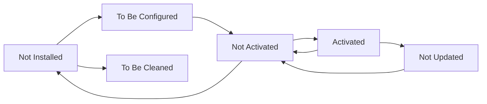

ITSM-NG features a powerful and flexible plugin system that allows you to extend the core functionality without modifying the base code. The plugin architecture is based on the Cacti plugin system and provides hooks, events, and registration mechanisms for seamless integration.

## Plugin Architecture

The ITSM-NG plugin system is built around several core concepts:

### Plugin States

Plugins can exist in multiple states throughout their lifecycle:

| State | Constant | Description |
|-------|----------|-------------|
| Unknown | `UNKNOWN` (-1) | Plugin state cannot be determined |
| New | `ANEW` (0) | Plugin discovered but not installed |
| Activated | `ACTIVATED` (1) | Plugin is installed and enabled |
| Not Installed | `NOTINSTALLED` (2) | Plugin is not installed |
| To Be Configured | `TOBECONFIGURED` (3) | Plugin installed but requires configuration |
| Not Activated | `NOTACTIVATED` (4) | Plugin installed but not enabled |
| To Be Cleaned | `TOBECLEANED` (5) | Plugin directory missing, needs cleanup |
| Not Updated | `NOTUPDATED` (6) | Plugin version mismatch, update required |

Source: `inc/plugin.class.php:46-87`

### Plugin Directory Structure

A typical plugin follows this structure:

```
plugins/myplugin/
├── setup.php           # Plugin configuration and registration
├── hook.php            # Hook implementations
├── locales/           # Translation files
│   ├── en_GB.mo
│   └── fr_FR.mo
├── inc/               # PHP classes
│   └── *.class.php
├── front/             # User interface files
│   └── *.php
└── ajax/              # AJAX handlers
    └── *.php
```

### Core Plugin Files

#### setup.php

The `setup.php` file is the entry point for your plugin. It must contain:

- **`plugin_version_myplugin()`** - Returns plugin metadata
- **`plugin_init_myplugin()`** - Initializes the plugin when loaded
- **`plugin_myplugin_install()`** - Installs the plugin (creates tables, etc.)
- **`plugin_myplugin_uninstall()`** - Uninstalls the plugin (removes data)

Source: `inc/plugin.class.php:228-260`

#### hook.php (Optional)

The `hook.php` file contains implementations of various hooks that the plugin responds to. This file is included when hooks need to be executed.

Source: `inc/plugin.class.php:1628-1636`

## Plugin Capabilities

### Registering Custom Item Types

Plugins can register custom item types using `Plugin::registerClass()`:

```php
Plugin::registerClass('PluginMyPluginItem', [
    'document_types' => true,
    'ticket_types' => true,
    'addtabon' => ['Computer', 'Ticket']
]);
```

Available registration options:
- `document_types` - Allow documents to be attached
- `ticket_types` - Allow tickets to be created for this type
- `networkport_types` - Allow network ports
- `addtabon` - Add tabs to specified item types
- `forwardentityfrom` - Inherit entity from another item type

Source: `inc/plugin.class.php:1307-1372`

### Hook System

Plugins can respond to various hooks throughout ITSM-NG:

- **`post_init`** - After all plugins are initialized
- **`post_plugin_install`** - After plugin installation
- **`post_plugin_uninstall`** - After plugin uninstallation
- **`post_plugin_enable`** - After plugin activation
- **`post_plugin_disable`** - After plugin deactivation
- **`post_plugin_clean`** - After plugin cleanup

Source: `inc/plugin.class.php:1383-1427`

### Adding Search Options

Plugins can add custom search fields to existing item types:

```php
function plugin_myplugin_getAddSearchOptionsNew($itemtype) {
    $options = [];
    
    if ($itemtype == 'Computer') {
        $options[] = [
            'id' => 9000,
            'table' => 'glpi_plugin_myplugin_items',
            'field' => 'custom_field',
            'name' => 'Custom Field'
        ];
    }
    
    return $options;
}
```

Source: `inc/plugin.class.php:1650-1680`

### Database Relations

Define foreign key relationships for your plugin:

```php
function plugin_myplugin_getDatabaseRelations() {
    return [
        'glpi_computers' => [
            'glpi_plugin_myplugin_items' => 'computers_id'
        ]
    ];
}
```

Source: `inc/plugin.class.php:1583-1595`

### Custom Dropdowns

Register custom dropdown tables:

```php
function plugin_myplugin_getDropdown() {
    return [
        'PluginMyPluginCategory' => __('My Plugin Category')
    ];
}
```

Source: `inc/plugin.class.php:1497-1508`

## Plugin Requirements

### Version Requirements

Plugins can specify version requirements in `plugin_version_myplugin()`:

```php
function plugin_version_myplugin() {
    return [
        'name' => 'My Plugin',
        'version' => '1.0.0',
        'author' => 'Your Name',
        'license' => 'GPLv2+',
        'homepage' => 'https://example.com',
        'requirements' => [
            'glpi' => [
                'min' => '10.0.0',
                'max' => '11.0.0'
            ],
            'php' => [
                'min' => '7.4.0',
                'exts' => ['curl', 'json']
            ]
        ]
    ];
}
```

Source: `inc/plugin.class.php:1793-1824`

### CSRF Compliance

All plugins must be CSRF compliant to be activated:

```php
function plugin_init_myplugin() {
    global $PLUGIN_HOOKS;
    $PLUGIN_HOOKS['csrf_compliant']['myplugin'] = true;
}
```

Source: `inc/plugin.class.php:803-813`

## Plugin Lifecycle

### Initialization Flow

1. **Discovery** - ITSM-NG scans the plugins directory
2. **Registration** - Plugin information is stored in the database
3. **Installation** - `plugin_myplugin_install()` is called
4. **Configuration** - `plugin_myplugin_check_config()` validates setup
5. **Activation** - `plugin_myplugin_check_prerequisites()` is verified
6. **Loading** - `plugin_init_myplugin()` initializes the plugin

Source: `inc/plugin.class.php:177-216`

### State Transitions



## Plugin Directories

Plugins can be located in multiple directories defined by `PLUGINS_DIRECTORIES`. The system searches these locations in order when loading plugins.

Source: `inc/plugin.class.php:233-259`

## Localization

Plugins support internationalization through `.mo` files in the `locales/` directory:

- Place translation files in `locales/en_GB.mo`, `locales/fr_FR.mo`, etc.
- Translations are automatically loaded when the plugin initializes
- Use standard gettext functions for translation

Source: `inc/plugin.class.php:288-378`

## Best Practices

1. **Always check prerequisites** - Implement `plugin_myplugin_check_prerequisites()`
2. **Validate configuration** - Use `plugin_myplugin_check_config()` for required settings
3. **Clean up on uninstall** - Implement proper `plugin_myplugin_uninstall()`
4. **Use namespaces** - Prefix all classes, functions, and tables with your plugin name
5. **CSRF compliance** - Always set `csrf_compliant` hook to true
6. **Version requirements** - Specify clear GLPI and PHP version requirements
7. **Database migrations** - Handle version updates in your install function

## Next Steps

- [Installing Plugins](/plugins/installation) - Learn how to install and manage plugins
- [Developing Custom Plugins](/plugins/development) - Create your own ITSM-NG plugins